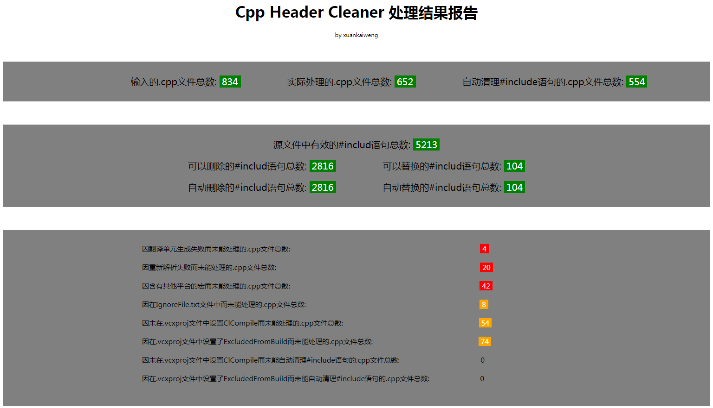

# 面临的问题
在头文件里改一行代码，点一下Build，切出去干点别的，喝口水，发会呆，切回来还没编译完……

对于C++码农来说以上情景实在是太熟悉了，要是正在赶版本，简直是急死个人。即使用上IncrediBuild，也只能实现并行编译，链接依然漫长。

C++编译速度慢的罪魁祸首就在于编译时需要将所有#include的文件（以及递归#include的文件）完整展开并解析。而事实上，由于各种原因（复制黏贴、需求变动、架构不合理等等），这些#include语句中有大量是冗余的。所以，我们希望能准确地识别出这些冗余的#include语句，并进行自动清理。

------------

# 一、主体思路
从原理上来说，一个.cpp文件之所以需要#include其他文件是因为这个.cpp文件中的符号（类、函数、变量、宏定义等）在其他文件中定义。所以，基本的想法就是：
1.找到.cpp文件中所有的符号分别在哪个文件中定义。
2.把这些文件#include进来，其他的#include语句自然就是冗余的。

### 1.1 找到符号定义
如何找到.cpp文件中所有的符号分别在哪个文件中定义呢？
1.对源代码进行解析，生成一棵AST（抽象语法树）。
2.根据AST中符号对象的信息找到这些符号的定义位置。

那怎么生成AST呢？这显然就是标准的编译器前端的干活。C++编译器这么重的轮子显然不可能重新撸，所以我们将clang集成了进来做这件事。

### 1.2 把需要的文件#include进来
现在我们已经找到了需要#include的文件，那怎么样把这些文件#include进来才最“好”呢？我觉得主要有三个标准：
1.#include语句最少。看着就爽。
2.递归#include进来的文件数量最少。毕竟我们清理的目的是缩短编译时间，而这个指标是和编译时间直接相关的。
3.对原文件的改动最小。保证代码的可读性，别乾坤大挪移改的自己都不认识了。

画几个图会更清楚一点：

显然，右边用绿圆圈表示的#include语句是冗余的，可以去掉：

如果以上述”2.递归#include进来的文件数量最少”为首要目标，则结果如下：

也可以做个折中，取需要#include的文件的公共根节点：

**CppIncludeCleaner实际选择了最后一种做法。**
上述清理步骤其实就是两步：
1.冗余的#include语句直接删掉。
2.剩下的#include语句按照上图所示替换为#include更下层的公共根节点。

当然，以上只是最简略的流程描述。实际上，一个文件完全可能通过不同的#include路径被上层文件#include，因此，文件之间的#include关系不能用一棵树来描述，而应该是一个DAG，也即有向无环图（暂不考虑循环#include的情况）。至于如何对这个DAG进行层层处理最终生成像上面这样清晰的树结构是一个略有点复杂的过程，如果对处理细节感兴趣可以直接参见代码。

作为总结，附上处理流程的框架图：

------------

# 二、CppIncludeCleaner的用法
### 2.1 配置Config.txt
clang的解析有非常多的参数，好在CppIncludeCleaner已经内置了默认配置并实现了.vcxproj工程文件的自动读取和解析，所以只需要在Config.txt中配置好.vcxproj工程文件路径就可以了：
1.vcxproj_path和vcxproj_filename：vcxproj工程文件的所在目录和文件名。

还有一些其他的配置项，按需配置，一般用默认的就行：
2.project_configuration：编译选项。如果是Windows平台、Debug模式，就用默认的Debug|Win32。如果需要其他的编译选项请从.vcxproj工程文件中的ProjectConfiguration中选一个。如果需要同时兼顾几种编译选项则用分号隔开，如：project_configuration=Debug|Win32;Release|Win32
3.macros_ignore：碰到哪些宏就不解析当前文件，用;隔开。这个主要是限制平台用的，如果一个.cpp文件中含有在其他平台运行的代码，则CppIncludeCleaner有可能会返回错误的结果。
4.enable_auto_clean：是否开启自动清理。默认是开启的，如果关闭就需要根据CppIncludeCleaner的运行结果手动清理#include语句。
5.enable_not_cl_compile、enable_auto_clean_not_cl_compile、enable_excluded_from_build、enable_auto_clean_excluded_from_build：
一个.cpp文件需要在vcxproj文件中被ClCompile定义，且没有被ExcludedFromBuild定义才能正常参与编译，否则要么是实际不用的，要么是被其他.cpp文件#include的，默认不进行解析。如果需要也可以进行解析和清理，然后手动修复可能产生的问题。

### 2.2 配置IgnoreFile.txt（可选）
如果有些文件人为地不希望被清理，可以将文件路径配在IgnoreFile.txt里，一行一个，如果是填相对路径的话以.vcxproj工程文件的位置为起点。

### 2.3 要清理的拖过去
配置完成后，将需要清理的（一个或多个）文件（或文件夹）选中拖动到CppIncludeCleaner.bat上，CppIncludeCleaner就会自动筛选出其中的.cpp文件按照配置进行清理。

------------

# 三、运行结果输出
CppIncludeCleaner运行完毕后会将汇总信息输出到statistics.html中并自动用浏览器打开（因为不太会html所以基本是硬写的，无论是代码还是显示效果都不甚理想……），类似下面这个样子：

如果enable_auto_clean=1则会自动对源文件进行改写。否则请在result文件夹下找到对应的源文件名+".txt"后缀的输出结果文件，里面有可以删除和可以替换的#include语句信息。

diagnostics文件夹结构和result相同，每一个源文件对应一个diagnostics文件，记录了clang生成AST的过程中产生的调试信息（diagnostics是clang的术语，我理解就是debug的意思）。
如果clang生成AST一切正常，那么这个文件是空的，否则可以用这个文件里的信息做一些调试。

debug文件夹结构也和result相同，与diagnostics文件记录clang生成AST的过程中产生的调试信息类似，debug文件记录了脚本在利用clang生成的AST进行后续处理时产生的调试信息。

------------

# 四、为什么要重新撸这个轮子
如前所述，清理.cpp文件中冗余的#include语句这个需求实在是古老而又普遍，因此很多前辈已经做过类似的工作，一个具有代表性的例子就是iwyu：https://github.com/include-what-you-use/include-what-you-use

但是身处一个产品导向的团队，如果iwyu足够好用，能够满足项目需求的话也就不会有CppIncludeCleaner了。下面就解释一下iwyu存在的主要问题及CppIncludeCleaner针对这些问题所做的改进。

### 4.1.太重
iwyu需要使用者自己下载安装clang，然后对iwyu进行cmake、编译，最后再使用命令行执行，使用步骤非常繁琐。

这个问题在CppIncludeCleaner中得到了很好的解决，基本实现了即下即用。这主要归功于架构的不同。区别于iwyu的纯C++架构，CppIncludeCleaner使用了Python脚本+libclang（clang官方提供给Python绑定的dll）的组合，因此在使用的便捷性上有很大的优势。

### 4.2.处理结果不对
如果说iwyu操作繁琐还只是体力活，那这个问题就比较致命了，主要有以下几个原因：

#### 4.2.1 输入参数复杂
要想让clang生成正确的AST，需要配置一连串的输入参数，对于不熟悉clang的人来说这个琢磨输入参数的过程非常痛苦。即使勉强琢磨出来了也很难保证与.vcxproj工程文件中的配置完全一致，生成出来的AST还是与Visual Studio生成的AST有很大差异。

这个问题在CppIncludeCleaner中基本完全得到了解决。所有固定的clang输入参数都集成在了CppIncludeCleaner内部，而与项目配置有关的输入参数则通过读取.vcxproj工程文件进行自动解析生成，暴露给使用者必填的只有.vcxproj工程文件的路径一项，从而保证了与Visual Studio的同一性。

#### 4.2.2 C++语言特性
C++有着复杂的语言特性，这使得要对所有.cpp文件都进行正确的解析并生成AST非常困难。关于这一点，iwyu自己给出了一个详细的解释：https://github.com/include-what-you-use/include-what-you-use/blob/master/docs/WhyIWYUIsDifficult.md

这个问题在CppIncludeCleaner中并没有得到根本性的解决，但是被很好地绕过了。
对于clang解析失败未能正确生成AST的文件，CppIncludeCleaner选择放弃清理。
此外，CppIncludeCleaner有自动重新编译的功能，也就是在自动清理冗余#include语句完毕后会重新再对清理后的文件尝试解析，生成AST，如果过程中出现错误则回退之前的清理工作。这样做就保证了清理过程不会引入编译错误。

------------

# 五、实测结果
上面“三、运行结果输出”中的示例图其实就是我目前的项目使用CppIncludeCleaner进行清理实际产生的输出。由于图片不太清楚，我把相关数据汇总在下面，并逐一进行解释。

1.所有待处理的.cpp文件共有834个，其中没有在.vcxproj工程文件中设置为不编译的有652个，后者处理后发现有554个文件中包含冗余的#include语句，根据配置对这些文件进行了自动清理。

2.这652个.cpp文件中共包含5213条有效的#include语句，其中2816条是冗余的被删除，104条被更下层的#include语句替代。可见冗余的#include语句比例还是非常大的，超过了50%。

3.有4个文件无法通过clang的解析生成AST，比例很小，只要识别出来不参与处理就可以了。

4.有20个文件在清理后的重新解析中失败，比例不大，自动将清理结果回退就可以了。

我又对cocos引擎代码使用CppIncludeCleaner进行了清理，725个.cpp文件中共包含3148条有效的#include语句，其中1426条是冗余的被删除，86条被更下层的#include语句替代。

关于编译时间，有两种测试方法：

1.全量编译。
这种测试方式最直接，但是并不能很好的反映清理效果。因为清理#include语句带来的编译时间的缩短很大程度上来源于修改某个.h文件后，需要重新编译的.cpp文件的数量变少，而在全量编译中，工程中每个有效的.cpp文件都是要被编译的。最终测试发现，清理后全量编译时间缩短了大约5%，这主要来自于.cpp文件编译时需要#include的文件数量变少了。

2.修改.h文件然后进行增量编译。
这是能够较好地反映清理效果的测试方式。我随机进行了20次测试，编译时间缩短了8%~22%不等，平均在13%左右。

------------

#六、本工具的不足
1.只能对独立的.cpp文件进行正确清理。所谓“独立”指的是这个.cpp文件没有被其他.cpp文件#include。对于不“独立”的.cpp文件，CppIncludeCleaner会根据Config.txt中的配置进行处理，详见上述“工具用法”的5.

2.只能对运行于Windows平台的.cpp文件进行清理。

3.清理时间过长。受限于libclang接口的龟速，CppIncludeCleaner清理652个.cpp文件大约用了一天的时间。但是考虑到这是一个一次性的离线处理过程，严重性又稍微小一些。

#七、未来改进计划：
上面所述不足中的三点其实是相互关联的。

事实上，整个工程是一个网状的结构，应该统筹考虑而不是一个一个清理。

首先，计划建立缓存机制。从底层开始进行clang解析，将生产的AST缓存下来，当上层文件#include这些文件时直接读取缓存的AST就好了，这样可以节省大量解析下层文件的时间。

然后，被#include的.h和.cpp文件也应该进行清理，这样会有更好的清理结果。当然这对算法提出了更高的要求。求最优解是一个NP的问题，得好好想想怎么用动态规划或者贪心高效地求一个次优解。

最后，要处理其他平台的文件肯定得把代码移植到其他平台上，主要工作是对.vcxproj工程文件的解析要重新写。如果一个文件里同时有不同平台的代码（用宏来控制），就得用上前面说的AST缓存了。

------------

# 八、其他补充
### 8.1 前置声明
从原理上说，一个.cpp文件中的符号在其他文件中定义并不一定要求我们将对应的文件#include进来，如果这个符号只是一个引用而不需要了解其内部信息，那么只需要做前置声明就可以了。

用前置声明替代#include语句可以实现进一步缩短编译时间的效果，事实上iwyu就实现了将非必须的#include语句用前置声明替代的功能。

那为什么CppIncludeCleaner没有实现这一功能呢？主要有以下两个原因：

#### 8.1.1 有副作用
用前置声明替代#include语句并不是没有代价的。事实上，Google C++ Style Guide（我个人比较认同这一规范）就明确要求避免使用前置声明，而应该全部用#include语句替代。

Google当然给出了这样做的理由，参见：https://google.github.io/styleguide/cppguide.html#Forward_Declarations

#### 8.1.2 懒
好吧，虽然我是google粉，但是理论上说一个工具还是应该尽量提供更多的功能供用户自行取舍。

用前置声明替代#include语句要求对符号进行更精细的解析，我在预研中发现很多所需的接口是libclang没有提供的，需要修改clang源码，囿于时间精力有限，暂时无力做这一部分功能，如果上述“七、未来改进计划”顺利完成的话可以考虑后续将这一功能集成进来。
